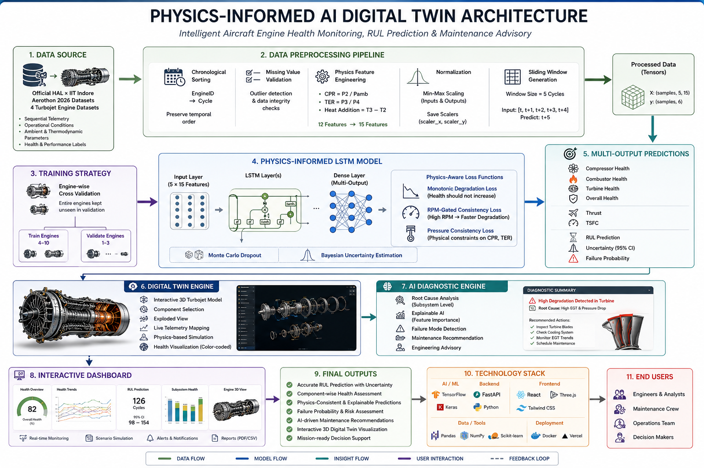
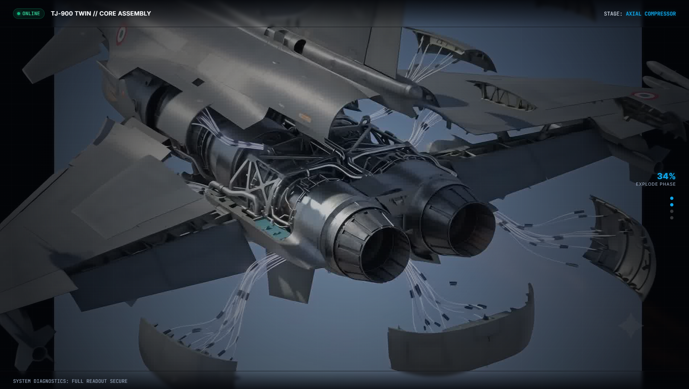
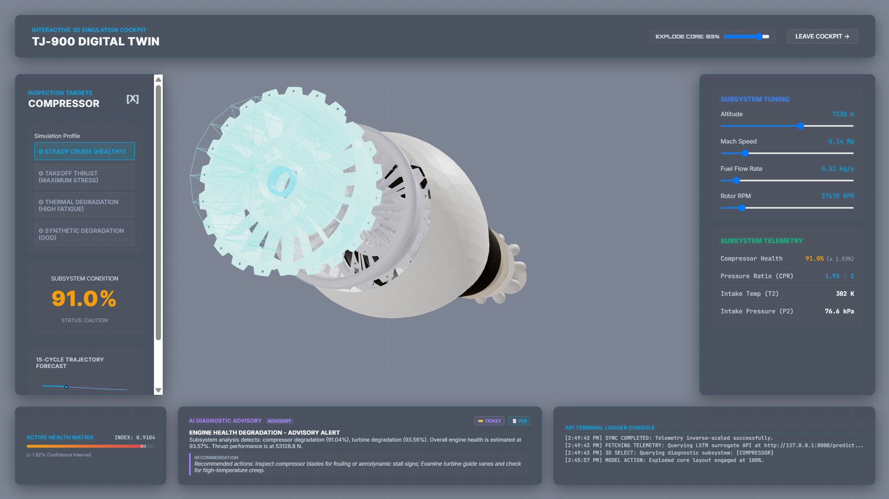

<div align="center">

# ✈️ HAL-INDORE
## Physics-Informed AI Digital Twin for Intelligent Aircraft Engine Health Monitoring

### 🚀 Aerothon 2026 | HAL × IIT Indore

A next-generation **Physics-Informed Digital Twin** that combines **AI, thermodynamics, uncertainty quantification, and interactive 3D visualization** for real-time aircraft engine health monitoring, Remaining Useful Life (RUL) prediction, subsystem diagnostics, and intelligent maintenance recommendations.


</div>

---

# 📖 Overview

Modern aircraft engines generate enormous amounts of telemetry during every flight. Conventional monitoring systems often rely solely on either **physics-based models** or **pure machine learning**, both of which suffer from limitations when operating under unseen conditions.

HAL-INDORE introduces a **Physics-Informed AI Digital Twin** capable of

- ✈️ Predicting Remaining Useful Life (RUL)
- ⚙️ Monitoring subsystem health
- 📈 Estimating uncertainty
- 🧠 Explaining model predictions
- 🔍 Performing interactive component-level inspections
- 🛠️ Generating intelligent maintenance recommendations

The platform combines aerospace engineering principles with modern deep learning to create a practical decision-support system for predictive maintenance.

---

# 🎯 Objectives

- Build a Digital Twin for aircraft engines
- Integrate physics-informed learning with deep neural networks
- Predict component-wise degradation
- Estimate Remaining Useful Life (RUL)
- Quantify prediction uncertainty
- Generate AI-assisted maintenance recommendations
- Enable interactive 3D subsystem inspection
- Support engineering decision making

---

# 🏗 System Architecture

```text
Official HAL Aerothon Dataset
                │
                ▼
      Data Preprocessing
                │
                ▼
 Physics Feature Engineering
 (CPR • TER • Heat Addition)
                │
                ▼
 Sliding Window Generation
                │
                ▼
 Physics-Informed LSTM
                │
                ▼
 Monte Carlo Dropout
                │
                ▼
 Multi-Output Prediction
                │
                ▼
 AI Diagnostic Engine
                │
                ▼
 Interactive Digital Twin
                │
                ▼
 Dashboard + Maintenance Advisory
```

<p align="center">
  
</p>

---

# 🔬 Technical Highlights

## Physics-Informed Learning

Unlike traditional black-box AI systems, our model embeds engineering knowledge directly into the learning process.

The framework incorporates

- Compressor Pressure Ratio (CPR)
- Turbine Expansion Ratio (TER)
- Combustor Heat Addition
- Thermodynamic constraints
- Monotonic degradation behavior
- Pressure consistency validation

---

## Deep Learning

The prediction engine uses

- Multi-output LSTM
- Physics-aware loss functions
- Monte Carlo Dropout
- Bayesian uncertainty estimation
- Sequence learning
- Temporal degradation modelling

---

## Digital Twin

Interactive engine simulation enables

- 3D engine visualization
- Component selection
- Exploded assembly view
- Live subsystem telemetry
- Health visualization
- Failure diagnosis
- Maintenance recommendations

---

# 📊 Dataset

The project is trained using the **official turbojet datasets provided for Aerothon 2026 by HAL × IIT Indore**.

The datasets include

- Sequential engine telemetry
- Operational conditions
- Ambient parameters
- Internal thermodynamic measurements
- Component health indicators
- Performance metrics

Each observation represents one operational cycle of an engine.

---

# ⚙️ Feature Engineering

Three physics-based features are generated

### Compressor Pressure Ratio

```
CPR = P2 / Pamb
```

### Turbine Expansion Ratio

```
TER = P3 / P4
```

### Combustor Heat Addition

```
Heat Addition = T3 − T2
```

The feature space expands

```
12 Features

↓

15 Physics-Aware Features
```

---

# 📈 Training Pipeline

- Chronological sorting
- Physics feature generation
- Min-Max normalization
- Sliding window creation
- Engine-wise cross validation
- Physics-aware optimization
- Monte Carlo Dropout inference

---

# 📦 Model Outputs

The model simultaneously predicts

### Health

- Compressor Health
- Combustor Health
- Turbine Health
- Overall Health

### Performance

- Thrust
- TSFC

### Analytics

- Remaining Useful Life
- Confidence Interval
- Failure Probability
- Root Cause Analysis
- Maintenance Recommendation

---

# 🖥 Dashboard Features

✅ Interactive 3D Digital Twin

✅ Exploded Engine View

✅ Component Selection

✅ Real-Time Telemetry

✅ AI Diagnostic Assistant

✅ Live Health Monitoring

✅ Scenario Simulation

✅ Maintenance Reports

---

# 📚 Technologies Used

## AI & Machine Learning

- TensorFlow
- Keras
- NumPy
- Pandas
- Scikit-learn

## Frontend

- React
- TypeScript
- Three.js
- Plotly
- TailwindCSS

## Backend

- FastAPI
- Python

## Deployment

- Vercel
- Docker

---

# 📂 Project Structure

```text
HAL-INDORE/

├── frontend/
│
├── backend/
│
├── model/
│
├── datasets/
│
├── preprocessing/
│
├── training/
│
├── inference/
│
├── utils/
│
├── assets/
│
├── docs/
│
└── README.md
```

---

# 🚀 Getting Started

Clone the repository

```bash
git clone https://github.com/your-username/HAL-INDORE.git
```

Install dependencies

```bash
pip install -r requirements.txt
```

Run backend

```bash
python app.py
```

Run frontend

```bash
npm install

npm run dev
```

---

# 📷 Screenshots

| Dashboard / Landing Page | Exploded View |
|:---:|:---:|
|  |  |

---

# 🔮 Future Improvements

- Transformer-based sequence models
- Reinforcement Learning for maintenance planning
- CFD-assisted Digital Twin
- Multi-engine fleet monitoring
- Cloud deployment
- Edge AI support
- Real aircraft telemetry integration

---

# 📖 References

- Raissi et al. — Physics-Informed Neural Networks (2019)
- Saxena et al. — Aircraft Engine Run-to-Failure Simulation (2008)
- Gal & Ghahramani — Bayesian Deep Learning (2016)
- Chao et al. — Physics-Based Prognostics (2022)
- Liao et al. — Physics-Informed RUL Prediction (2023)

---

# 👥 Team

**Habeeb Ur Rahim Khan**

Project Lead • AI/ML Engineer • Full Stack Developer


<div align="center">

### ⭐ If you found this project interesting, consider giving it a star!

Built with ❤️ for **HAL × IIT Indore Aerothon 2026**

</div>
